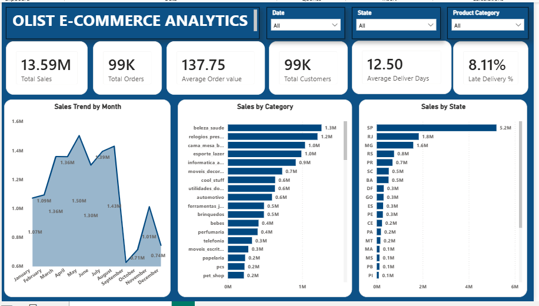

 # Olist E-Commerce Sales Analytics

An end-to-end e-commerce data analytics project using SQL and Power BI to analyze sales performance, customer behavior, product categories, and delivery performance.

## 📊 Dashboard Preview



---

## 🎯 Project Objective

The objective of this project is to analyze e-commerce data and identify meaningful business insights related to:

- Sales performance
- Order trends
- Customer behavior
- Product categories
- State-wise sales
- Delivery performance
- Late deliveries

The analysis was performed using SQL and the results were visualized through an interactive Power BI dashboard.

---

## 🛠️ Tools & Technologies

- **SQL**
- **MySQL / MariaDB**
- **MySQL Workbench**
- **Power BI**
- **Data Cleaning**
- **Data Analysis**
- **Data Visualization**

---

## 📁 Dataset

The project uses the **Brazilian Olist E-Commerce dataset**, containing information about orders, customers, products, sellers, payments, reviews, and deliveries.

The dataset contains approximately 100K orders and multiple related tables.

---

## 🔍 Business Questions

The analysis answers important business questions such as:

1. What are the total sales and total number of orders?
2. What is the average order value?
3. How do sales change month by month?
4. Which product categories generate the highest sales?
5. Which customers place the most orders?
6. Which sellers perform the best?
7. What is the average delivery time?
8. What percentage of orders are delivered late?
9. Which states generate the highest sales?
10. How does delivery performance vary across states?

---

## 🧮 SQL Analysis

SQL was used to extract and analyze data from the Olist database.

Key SQL concepts used:

- SELECT
- WHERE
- GROUP BY
- ORDER BY
- Aggregate Functions
- COUNT
- SUM
- AVG
- DISTINCT
- INNER JOIN
- CASE
- DATE_FORMAT
- Subqueries
- CTEs
- LIMIT

The SQL queries used for the analysis are available here:

📁 `SQL/analysis_queries.sql`

---

## 📈 Power BI Dashboard

An interactive Power BI dashboard was created to monitor the major e-commerce KPIs.

### Key KPIs

| KPI | Value |
|---|---:|
| Total Sales | 13.59M |
| Total Orders | 99K |
| Average Order Value | 137.75 |
| Total Customers | 99K |
| Average Delivery Days | 12.50 |
| Late Delivery % | 8.11% |

### Dashboard Visualizations

The dashboard includes:

- Monthly Sales Trend
- Sales by Product Category
- Sales by State
- Total Sales
- Total Orders
- Average Order Value
- Total Customers
- Average Delivery Days
- Late Delivery Percentage

### Interactive Filters

Users can filter the dashboard by:

- Date
- State
- Product Category

---

## 💡 Key Insights

The analysis helped identify several important patterns:

- Sales performance varies significantly across different months.
- A small number of product categories contribute a large portion of total sales.
- São Paulo is the strongest state in terms of sales.
- Delivery performance varies across states.
- Late deliveries represent a measurable portion of total orders.
- Customer order frequency can be used to identify highly engaged customers.

---

## 📂 Project Structure

```text
olist-ecommerce-sales-analytics/
│
├── README.md
│
├── PowerBI/
│   └── Olist_Ecommerce_Sales_Analytics.pbix
│
├── SQL/
│   └── analysis_queries.sql
│
└── Images/
    └── dashboard.png
